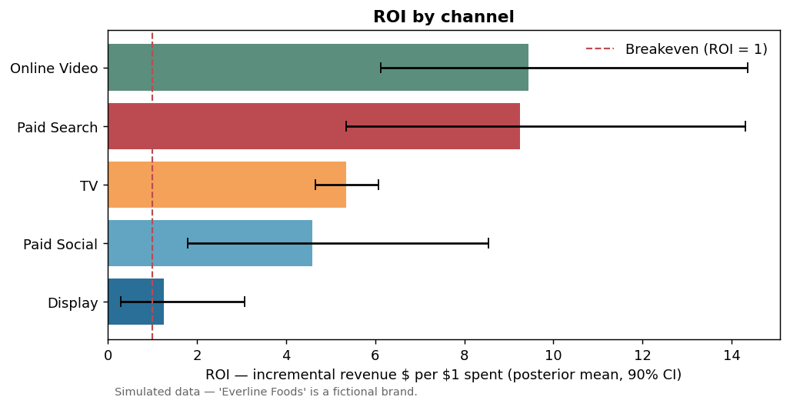
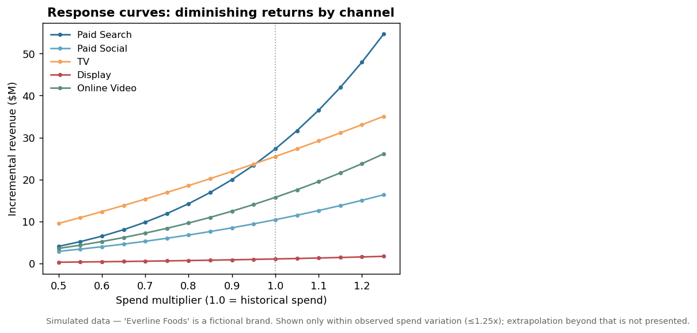
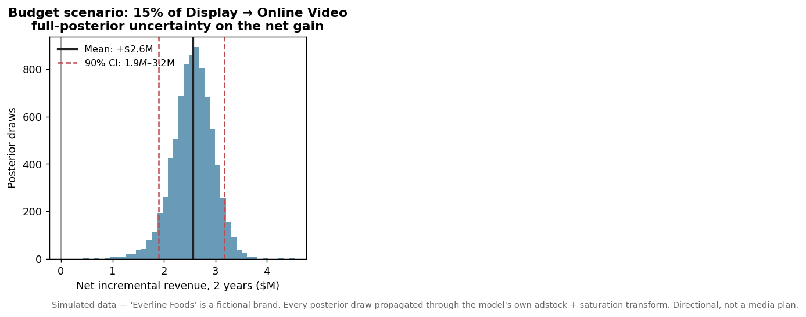

# MMM Case Study: "Everline Foods" (SIMULATED DATA)

All data here is simulated. "Everline Foods" is a fictional brand. The
datasets were generated with a known data-generating process (adstock +
saturation + seasonality + promo + noise) so the full workflow can be shown
end to end, including checking the model's answers against the truth.

## The charts



Channel ROI, posterior means with 90% credible intervals. Paid search's
interval spans nearly 3x, so the point estimate should not drive budget
decisions on its own.



Diminishing-returns curves within observed spend variation (≤1.25x). Curves
are not extrapolated past what was observed.



Full-posterior net-gain distribution for shifting 15% of display spend into
online video: +$2.6M expected, 90% interval $1.9M–$3.2M. Directional, not a
media plan. The read is a hypothesis for an incrementality test.

## What this is

End-to-end Marketing Mix Modeling with
[Google Meridian](https://github.com/google/meridian) on 104 weeks of weekly
CPG-style data: 5 media channels, price, promo, seasonality, revenue.
4 chains × 2000 kept draws, informed priors per channel. A 12-geo variant of
the dataset feeds a synthetic transportability check (chart 09): the national
response-curve shape applied to separately simulated geos, scored against
known truth. That is a curve-shape transport test, not a holdout validation
and not a randomized experiment.

Details, calibration against truth, and the CMO read-out are in
`docs/case_study.md`.

## v1 → v2 rebuild log

Several things changed at once, so the v1/v2 before/after chart documents a
rebuild, not a controlled comparison:

- Simulated dataset: TV flights staggered against promo weeks (v1 ran every
  flight on top of promo weeks); new random seed.
- Saturation priors tightened (ec sigma 0.9 → 0.45, slope sigma 0.6 → 0.35).
- MCMC: 2 chains × 500 draws → 4 chains × 2000.
- Response curves shown only within observed spend variation.
- Prior-vs-posterior shift charts added (07, 08).

## Limitations

- Simulated data: clean by construction. Real data has messier confounders
  this demo does not include.
- 104 weeks is the minimum viable history; real MMMs prefer 2–3+ years.
- ROI estimates are posterior means with wide credible intervals; the
  ranking is more reliable than any point estimate.
- Paid search is materially unidentified here (estimated 9.2 vs true 4.5):
  spend tracked the brand trend, so the model can't separate the two. Its
  ROI should not guide allocation without calibration.
- R-hat ≈ 1.00 means the chains mixed; R² 0.94 means the model fits the
  data. Neither means the channel attributions are causally correct.
- The budget scenario is directional. Marginal returns are the
  least-identified part of any MMM.

## Reproduce

```bash
python -m venv .venv && source .venv/bin/activate
pip install -r requirements.txt   # google-meridian + deps
python scripts/01_simulate_data.py
python scripts/01b_simulate_geo.py
python scripts/02_fit_meridian.py  # MCMC; ~15-25 min on CPU (4 chains x 2000 draws)
python scripts/03_readout.py       # tables, charts, data/readout.json
python scripts/04_transportability_check.py  # transportability check
```

On machines with a small /tmp (e.g. 512MB tmpfs), point pip's temp dir at
real disk or the Meridian download will fail: `TMPDIR=~/.pip-tmp pip install
-r requirements.txt`.

## Repo layout

```
mmm-case-study/
├── data/
│   ├── simulated_mmm_weekly.csv   # national dataset (SIMULATED)
│   ├── dgp_truth.yaml             # ground truth of the national simulation
│   ├── simulated_mmm_geo.csv      # geo variant: 12 geos x 104 weeks (SIMULATED)
│   ├── dgp_truth_geo.yaml         # ground truth of the geo simulation
│   ├── inference_data.nc          # fitted posterior + prior draws
│   ├── v1_response_curves.npz     # v1 search response curve (rebuild log)
│   ├── readout.json               # headline numbers (national read-out)
│   └── transportability_check.json
├── scripts/
│   ├── 01_simulate_data.py        # builds the national dataset
│   ├── 01b_simulate_geo.py        # builds the geo variant dataset
│   ├── 02_fit_meridian.py         # trains the Meridian model, saves diagnostics
│   ├── 03_readout.py              # contribution, ROI, scenario, charts
│   └── 04_transportability_check.py
├── charts/                        # output figures (v1 archived in v1_before/)
├── docs/
│   └── case_study.md              # full write-up
└── README.md
```
